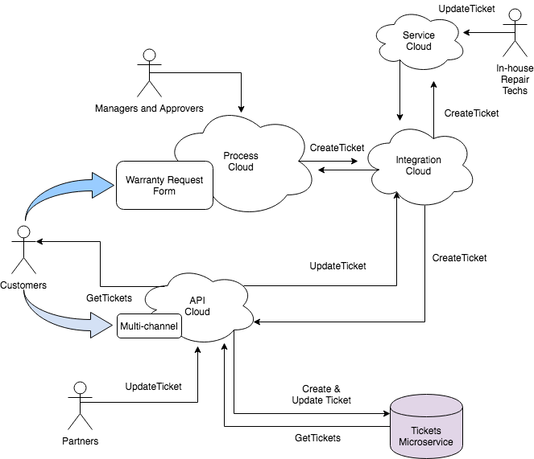

# Warranty Claim

## Introduction

NexGen is a company that as a wide variety of products.  As a part of selling products, NexGen offers warranty coverage and on occasion, a customer needs to make a claim for service under the warranty agreement.  NexGen management is growing concerned that as their product line increases, the costs of maintaining the warranty fulfillment are growing considerably.  In a recent strategy session, NexGen identified a number of areas that they could improve their warranty claims management.  

### Identified Pain-points
Here are some of the current pain-points:
1. The claim in-take manual and expensive.  Each case may be received via phone, or paper often resulting in requiring personnel to contact the customer to get details.
1. The service ticketing is mixed in some manual systems and legacy systems due to acquisitions over the years
1. The company has to maintain a large servicing personnel and are finding it increasingly difficult to maintain skillsets for certain products that they sell 

### Proposed Solutions
Here are some of the solutions
- Use a modern service ticketing system.  
  - NexGen chose and implemented Oracle Service Cloud.  This makes it easier for all of NexGen sales and service employees to take care of the customer
- Create a modern web interface for customers to be able to submit warranty claims.  This interface should be part of a process management system that has the ability to connect to various legacy back-end systems as well as SaaS applications.  
  - NexGen chose and implemented Oracle Integration Cloud.  This eliminates many manual, error-prone steps as well as provides great flexibility for the future
-  Enter into a series of partnerships with service firms who can take care of repairs for certain product lines.  These partners are expected to represent NexGen by completing the repair and updating ticket statuses as if the product were repaired or replaced directly by NexGen
  - NexGen is choosing Oracle API Platform Cloud Service.
  - Using API Platform Cloud Service, NexGen will provide an API to partners to be able to query and update Service Tickets. 
    - This API will give the partner the necessary access without having to add the partner to back-end/SaaS applications like Oracle Service Cloud.
    - Some of the partners have their own ticketing system which they will be able to integrate with the API that NexGen will provide
    - Through this process, NexGen discovered that it would be a great ideal to implement a microservice to handle query requests.  NexGen may want to in the future provide a mobile app to their customers and they realize that customers may check the status of their warranty claim quite often.  They want to offload that query traffic to a microservice.

### Use-case
This use-case is the Warranty Claim that is used across Integration, Process and API.  This is designed to provide a more realistic case as a narrative for the following goals:
1. Oracle Integration Cloud (Covered in other labs)
  1. Create web-form and connect it to a warranty claim business process (Process Cloud)
  1. Connect to Service Cloud with a REST interface that reshapes the message and provides orchestration where necessary (Integration Cloud)
1. Oracle API Platform Cloud (*Covered in this lab*)
  1. Create an API that interacts with a Microservice
  1. Link the API with the Integration Service

This series of learning paths and tutorials will primarily leverage the *API* portion of this scenario but to "see the big picture" here is an overview diagram of the use-case


## Implementing the Warranty Claim Ticket Service API
Now that you understand NexGen's use-case above, here are the project requirements below that you received from your project manager.

### Before you begin
As you progress through this use-case, you will need to get access to both environments.  At the point of the tutorial where you will need access, the tutorial will advise you.  If you want to begin preparing ahead of time, you can [check out the options](../../environments) and decide which option makes sense for you.

### Design the API
Design is critical as a first step for great APIs.  Collaboration ensures that we are creating the correct design.  We need our API to be well documented and we need to create a mock service in order to rapidly prototype our API
- Follow the [Designing an API](../../tutorials/design/design_api) tutorial, to Design your API

Now you have an API Design that all of your stakeholders clearly understand and have agreed to.  Your engineering teams can leverage the mock service as they develop their respective components.  You know that this will ultimately be made available to partners, so you want to get started on the policy enforcement implementation

### Creating an API Policy Implementation
Part of what makes an API great is that it is secure.  Go ahead and begin creating your API Policy implementation so that your teams can begin using that
- Follow the [Creating an API Policy Implementation](../../tutorials/manage/apis/create_api) tutorial to create your API.  In this tutorial, you will:
  - Sign in as an API Manager
  - Create an API
  - Configure Endpoints

At this point, you have a simple API Policy Implementation that provides the *proxy pattern*.  The *proxy pattern is simply one end-point that receives a request and routes that request to another end-point.  Of course, you only have the API defined, it is not running anywhere! 

- Follow the [Deploying an API](../../tutorials/manage/apis/deploy_api) tutorial to deploy your API
  - Be aware that you may need to apply certain grant(s) to your gateway.  If so, follow the [Managing Access Grants on Gateways](../../tutorials/manage/gateways/grants)

Depending on your needs, an API manager can create the API Implementations and another person will handle the deployment to a gateway.  This makes the most sense in the case of a production gateway where you want to restrict access to deployments.

You now have an API that simply receives the request and routes it to the back-end service.  That back-end service at this point is simply the mock service from Apiary.  Do you know why we would use the mock-service URL?  Oftentimes, there are multiple teams participating in the development process.  There may be front-end developers creating a new mobile app or chatbot, there can be a back-end services and integration team and of course the API team.  If the back-end service is not yet ready, you can start creating the API implementation and point it to the mock-service.

Perhaps you may want to begin with a basic implementation so your front-end developers are already pointing to the API, even before it is fully operational.

#### Test the API
Now that the API is deployed, you can invoke it in your favorite REST client.
##### Identify the URL to use
In order to invoke your API, you need to identify the URL.  To do this, you can view the deployment.  You can do this at the API level or the Gateway level depending on the user you are logged in as.
###### API Gateway Manager
If you are logged in as a user who manages the gateway, you can view the URL from the Deployments tab of the gateway
1. Select Gateways
1. Select your Gateway
1. Click the *Deployments* left-tab
1. Make sure the *Deployed* top-tab is highlighted
1. Find your API
1. Notice the *Load Balancer URL* and the _copy_ icon next to it.  You can click the _copy_ icon to copy the URL into your buffer

###### API Manager
If you are logged in as a user who manages the API, you can view the API URL from the Deployments tab of the API
1. Select APIs
1. Select your API
1. Click the *Deployments* left-tab
1. Make sure the *Deployed* top-tab is highlighted
1. Find the gateway (one API can be deployed to multiple gateways)
1. Notice the *Load Balancer URL* and the _copy_ icon next to it.  You can click the _copy_ icon to copy the URL into your buffer

##### Invoke the API
Choose your favorite REST client.  For this exercise, you could simply use a web-browser because it is a simple _GET_ request. 
- Define the URL to be the *Load Balancer URL* you captured in the previous step, plus the resource.
  - _Example: http://`<host>`:`<port>`/ticketService/1/tickets_
- Verb: GET
- Headers (optional):
  - Accept: application/json
- Send the request to the API

Because you have not applied any policies, the request is passed to the backend service without further validation.  This is simply the “proxy pattern”. You should have received a response similar to the following. 

```
        {
              "_items": [
                {
                  "customer": "ACME Corp",
                  "status": "Resolved",
                  "product": "Widget",
                 "_id": "589a3774ebee507f7268bcff",
                 "_updated": "Tue, 07 Feb 2017 22:05:38 GMT",
                 "summary": "Customer reports the widget stopped working",
                  "_links": {
                    "self": {
                      "href": "tickets/589a3774ebee507f7268bcff",
                      "title": "Ticket"
                    }
                  },
                  "_created": "Thu, 01 Jan 1970 00:00:00 GMT",
                  "ticketID": "45001",
                  "_etag": "bd584d9a460eabdc979e428e1e0220923b0c5793",
                  "subject": "Widget stopped working"
                },
                {
                  "customer": "ACME Corp",
                  "status": "Unresolved",
                  "product": "Widget",
                  "ticketID": "45002",
                  "_updated": "Tue, 07 Feb 2017 21:44:21 GMT",
                  "summary": "Customer reports the widget stopped working",
                  "_links": {
                    "self": {
                      "href": "tickets/589a3fb534605c000176ef5f",
                      "title": "Ticket"
                    }
                  },
                  "_created": "Tue, 07 Feb 2017 21:44:21 GMT",
                  "_id": "589a3fb534605c000176ef5f",
                  "_etag": "cfe52a36fa7a1c738acc994f6e49a8f3f86ce4bf",
                 "subject": "Widget stopped working"
                },
                {
                  "customer": "ACME Corp",
                  "status": "Unresolved",
                  "product": "Widget",
                  "ticketID": "45002",
                 "_updated": "Tue, 07 Feb 2017 21:44:37 GMT",
                  "summary": "Customer reports the widget stopped working",
                 "_links": {
                   "self": {
                     "href": "tickets/589a3fc534605c000176ef60",
                     "title": "Ticket"
                   }
                 },
                  "_created": "Tue, 07 Feb 2017 21:44:37 GMT",
                  "_id": "589a3fc534605c000176ef60",
                  "_etag": "dbcf344b1bcaf9fc6781846ed944d147a875394c",
                  "subject": "Widget stopped working"
                },
               {
                 "status": "Resolved",
                  "_updated": "Tue, 07 Feb 2017 21:57:59 GMT",
                  "_links": {
                    "self": {
                     "href": "tickets/589a4133fbcb600001ac564b",
                      "title": "Ticket"
                   }
                 },
                 "_created": "Tue, 07 Feb 2017 21:50:43 GMT",
                 "_id": "589a4133fbcb600001ac564b",
                 "_etag": "a8706300f0a38c1d6aa871901475d2f7a9e29e1d"
               },
               {
                "customer": "Smithers Corp",
                "status": "Unresolved",
                "product": "Idea tablet",
                "ticketID": "45003",
                "_updated": "Sun, 12 Feb 2017 21:28:52 GMT",
                "summary": "When powering up unit, the display is blank",
                "_links": {
                 "self": {
                    "href": "tickets/58a0d394e0577b0001bcc981",
                    "title": "Ticket"
                    }
                 },
                 "_created": "Sun, 12 Feb 2017 21:28:52 GMT",
                 "_id": "58a0d394e0577b0001bcc981",
                 "_etag": "7a898301b641f1f28dbcf69a6c0dfadf292d6861",
                 "subject": "Display blank"
               }
             ],
              "_links": {
               "self": {
                 "href": "tickets",
                "title": "tickets"
              },
              "parent": {
                "href": "/",
                "title": "home"
              }
            },
             "_meta": {
               "max_results": 25,
               "total": 5,
              "page": 1
             }
            }
 ```
 
> Extra Credit: Find the analytics that will show your call.  Log in as the API Manager, choose the API and click the analytics side-tab.  Sign in as the gateway manager, choose the gateway and click the the analytics side-tab.  What are some of the differences between the analytic views for the gateway manager vs. the api manager?
 
### Add and Configure Policies to your API
Policies in API Platform Cloud Service serve a number of purposes. You can apply any number of policies to an API definition to secure, throttle, limit traffic, route, or log requests sent to your API. Depending on the policies applied, requests can be rejected if they do not meet criteria you specify when configuring each policy. Policies are run in the order they appear on the Request and Response tabs. A policy can be placed only in certain locations in the execution flow. This lab explicitly indicates where you should place each policy.

In these exercises, you will apply the following policies: 

- Security
  - Key Validation (_Draft_)
- Traffic Management
  - Application Rate Limiting (_Draft_)
- Interface Management
  - Header Validation
  - Interface Filtering
- Other
  - Groovy Script

> Note: You apply the key validation and application rate limiting policies as Drafts here. You activate them later in the lab. These require that you create and register an application, which is described in a later section.

Believe it or not, you have already applied policies!  The *API Request* and the *Service Request* are policies so you should already be familiar with the general steps of applying a policy.  Here we are going to provide you with the policies and the configuration values you should use.  See if you can make your way through without having to refer to the examples.  Don't worry though, if you get confused, then the examples should help you through.

If you are not already at the *API Implementation*
- Log into API Platform as *API Manager*
- Select *APIs*
- Choose your API
- Click the *API Implementation* side-tab

> Note: you have policies on the right-hand side that are collapsed in groups.  You can expand the groups to see the policies.

To apply a policy
- Hover your mouse over that policy in the right-hand list and click *Apply*
- Complete fields in the wizard which may be multiple panels.
- When you have your policy configured and are satisfied you can click *Save* or *Save as Draft*
  - *Save* saves the policy entry
  - *Save as Draft* saves it, but it won't be active until you return and *Save* it

Now, let's apply policies to this API

#### Security
Beginning with security, we are going to configure a *Key Validation* policy.  However, we are going to save it as draft at this point because we want to have it in our API, but not yet enforcing requests.  This allows us to work with our implementation and collaborate with others before our changes become active.  See if you can add a *Key Validation* policy that satisfies the requirements below.

#####Key Validation (Draft)
- Key Delivery Approach: Header
- Key Header: app-key

*Apply as Draft*

#### Traffic Management
A great API makes sure that no one consumer abuses the API.  We want to apply an *Application Rate Limiting* policy which simply controls the number of requests any one application can make within a time-period.  Since we are not yet activating the *Key Validation* policy, we will save this one as draft also.

##### Application Rate Limiting (Draft)
- Place after the following Policy: Key Validation
- Rate Limit Per Application: 10
- Time Interval: Minute

*Apply as Draft*

#### Interface Management
Sometimes we need to make sure the request contains a certain header, or ensure that header is within a certain value range.  We can apply the *Header Validation* policy.  Make sure we validate the header only after the *Key Validation* and the *Application Rate Limiting* policy.  This policy is not related to an application, so we can go ahead and apply it once we have configured it.

##### Header Validation
- Place after the following Policy: Application Rate Limiting
- PASS request if ANY of the following header conditions are met
- tenant-id >= 1

*Apply* the Policy

> Now is a good time to click *Save*

Take a moment to review your implementation so far.  Notice the difference between the *Key Validation*, *Application Rate Limiting* and *Header Validation* policies in your API?  The first two should have a dotted line indicating that they are saved as draft.

###### Extra Credit
Go ahead and re-deploy your API.  Once deployed, or requesting deployment, look at the API Deployment from the gateway perspective.  Expand the API deployment.  Do you see the policies that are in draft?
 
##### Interface Filtering
Apply the *Interface Filtering* policy, which is used to filter requests based on the resources and methods specified in the request. Here, you’ll configure this policy to pass GET requests to one resource, /tickets (which returns all tickets) but reject any other type of request.

- Place after the following Policy: Header Validation
- *Pass* the request if the resource and method combination is listed below
  - Condition 1
    - Resources: /tickets
    - Methods: GET
    
*Apply* the Policy

#### Other
##### Groovy Script
The Groovy Script policy opens up many opportunities to add functionality when a policy does not yet exist.  In this exercise, we will add a very simple Groovy script to see how this policy works.  Our script is very simple for the purposes of our exercise and it is as follows:
```
if (context.apiRequest.getHeader("Content-Type") == null)
    context.serviceRequest.setHeader("Content-Type", "application/json")
```

Add the groovy policy as follows:
- Place after the following Policy: Interface Filtering
- Enter the groovy script above.

*Apply* the policy

*Save* your API 
  
Go ahead and re-deploy your API with your new changes.


### Invoke the API
Now that you have successfully added policies to your API, you can send requests to ensure the policies work as intended.  You have already invoked your API, so return to your favorite REST client and invoke the API again.  You can revisit the [Invoke the API](#invoke-the-api) portion of this lab.
  
This time when you invoke the API, the request is rejected with a _Bad Request_ message. Why? Because of the header validation policy, you need to include a tenant-id header with a value of 1 or greater.

In your REST client, add the following request header

- Name: tenant-id
- Value: 1

You should now get a response like you did in the [Invoke the API](#invoke-the-api) tutorial

Now, let's try calling a different resource

In your REST client, replace *tickets* with *partners* in your URL and send the request again. 

If you configured your Interface Filtering policy, you should have received the following:
The request is rejected with a *Method not allowed* message. Why? Because of the interface filtering policy, requests to this resource are rejected. The policy rejects requests to any resource other than /tickets*. This is designed to protect the underlying API from callers trying to call resources you don’t intend to expose.

### Publish the API
A great API can be discovered by potential consumers.  Publishing the API makes it available in the developer portal for developers who are creating a wide variety of applications.  Developers search for and learn about APIs in the developer portal.  The API Manager typically publishes the API when it is ready for other users to be able to consume it.  Some examples are:

- An API is ready to be made available for general consumption:  This is typically an API in production with all of the work completed.
- An API that is released just to a select group of developers: This is typically an API that is not yet ready for production, but a select group of developers are provided access in order to try the API while it is under development.

In this exercise, you will learn about:
- Configuring the full Developer Portal URL
- Configuring the Overview Text
- Configuring the Documentation Page
- Previewing the Content
- Publishing, Re-Publishing, and Un-Publishing

#### Configuring the API Documentation
You've been working as the API Manager on the API Implementation, now select the *Publication* side-tab

Update the API Portal URL, this serves as the “permalink” for your API’s developer portal page.  Notice that the URL begins with `<not published>`  This is a placeholder that will update to the actual developer portal location.  The value you are providing is the end-point for your APIs developer portal page.  You can use any value you want, but we suggest you just use the name of your API.

Under *Documentation*, click the Apiary Link
 
Choose your API Blueprint and click “Connect”

TODO: Move publication to its own tutorial and provide path for Apiary team and non Apiary team.

Save your changes, then click *Publish to Portal*
 

Now, you can select the > next to the API Portal URL, to open the APIs developer portal page

You may have to log in, just use your *API Manager* credentials.  You should then see the Portal page for your API which includes your API Blueprint!
 
#### Publishing, Re-Publishing, and Un-Publishing
Whenever you make changes to the General Settings tab, including updating an API’s description, overview text, or documentation, you must republish for the latest changes to be pushed to the Developer Portal.

Note: API Platform Cloud Service retains only the current iteration of an API. When saved, updates to an API (including publishing, republishing, and unpublishing), take immediate effect. When you publish, the most recently saved version API details are pushed to the Developer Portal.

You can unpublish an API from the Developer Portal. If unpublished, Application Developers to be able to discover and subscribe to your API. Requests are still handled by the gateway as usual until the API is deactivated or undeployed from the gateway.
 
###API Grants

TODO: Move API Grants to a separate tutorial

This section provides information and procedures for issuing API grants. Every action a user performs on an object in API Platform Cloud Service is made possible by a grant. Each role is eligible to receive only select grants. This section describes different grants for an API object.

These are the available API grants:
- Manage API
- View API Details
- View API Public Details
- Deploy API
- Register App
- Request Register App

#### Manage API Grant (informational--no activity in this section)
The Manage API grant is available only to an API Manager. It is given automatically to the person who creates an API. Administrators do not specifically need this grant.

The Manage API grant gives an API Manager the right to view and edit API details, deploy or delete an API, and to issue grants to other API Managers.

#### View API Details Grant (informational--no activity in this section)
The View API Details grant allows API Managers and Gateway Managers to view the details of an API in read-only format in both the Management and Developer Portals.

The information available includes general information, implementation, deployed endpoints, users, applications, and analytics. In this lab, the View API Details grant would be given to other employees of the company to allow them to view API implementation details.
6.3: View API Public Details Grant (informational--no activity in this section)
The View API Public Details grant is available to Application Developers. It allows them to view an API’s details page on the Developer Portal. 

This grant does not allow Application Developers to register or to request registration of their applications to this API; the Register App grant is described in a later section.
 
#### Deploy API Grant (informational--no activity in this section)
To allow a Gateway Manager to deploy an API without making a formal request, the API Manager who created the API gives the Gateway Manager the Deploy API grant.

API Managers already have permission to deploy APIs they own due to being issued the Manage API Grant. A Deploy API grant can be given to an API Manager to allow them to deploy an API they did not create.

#### Register App
The Register App grant allows a user to register an application to an API without another user’s approval. This grant also gives the user the right to view the API; you do not need to issue a separate view grant to a user if you give them the Register App or Request Register App grants.

This grant is issued to Application Developers or API Managers.

To give the Register App grant to an Application Developer user:
- Click the User Management tab.
- Click the Register tab, and then click Add Grantee.
- Enter Application Developer User in the Choose Grantee field and press Enter. 
- Select Application Developer User and click Add. This user has been given the Register App grant; notice their name is added to the Register tab.

#### Request Register App Grant (informational--no activity in this section)
Like the Register App grant, the Request Register App grant is issued to Application Developers or API Managers. Users issued this grant can only request a registration. While their request is being reviewed by an API Manager, they cannot use the API. An API Manager must approve the registration request for the runtime key validation policy to approve requests sent to an API using this application’s key.
 
### API Catalog
The Developer Portal provides discovery, learning, and registration for APIs. It is the web page where you subscribe to APIs and get the necessary information to invoke them. 

When you access the Developer Portal, the API Catalog page appears. All the APIs that have been published to the portal are listed.

Get ready to learn about: 

- Discovering APIs
- API Portal
- API Portal Documentation

#### Discover APIs
You can search for an API by entering keywords in the field at the top of the catalog. The list is narrowed to the APIs that have that word in the name or the description. If you enter multiple words, the list contains all APIs with either of the words; APIs with both words appear at the top of the list. If a keyword or keywords have been applied to the list, they appear in a bar at the top of the page. Filters can also be applied to the list. You can also sort the list in alphabetical order or by newest to oldest API.

In this task you sign in as Application Developer User from the previous section. You granted this user the Application Developer role, meaning they are able to view APIs in the catalog and register them to applications without requesting approval.

To log in as Application Developer User:
- In an incognito window, a private browser session, or an entirely different browser, navigate to https://oc-129-150-76-122.compute.oraclecloud.com/developers This is the Developer Portal UI. You use incognito mode as the session persists between the Management Portal and the Developer Portal if you use the same browser session.

Only APIs that have been published appear in the catalog. If you have not published your API, see Section 3.5: Publishing, Re-Publishing, and Un-Publishing. To view an API, the Application Developer must also have the View API Details grant or another grant that implies these privileges. You gave the Application Developer User the necessary grant in Section 4.4: Register App.

 
##### To discover APIs in the catalog:
- From the API catalog page, enter Ticket, or another query, in the search box at the top, and then press Enter. All of the APIs matching this query appear.
- To clear the results, in the blue bar below the search field, click the X. You can also click Clear All to clear all the search terms.
- Click +Filters to apply a filter. In the Status section, click Released. This is the default status of an API. If you create APIs with different statuses, those statuses appear as options in this filter list.
- Click Clear All to clear all filters.
- To sort the APIs by creation date, from the Sort by list, click Newest. To sort the APIs by name, from the Sort by list, click Alphabetical.
- API Portal (informational--no activity in this section)
When you select an API from the API Catalog, its API Portal details page appears. This page displays information about an API. You can see the state of an API (Beta, Released, Deprecated, etc), whether you can register to it, any applications that you have already registered to it, registration requests awaiting approval, etc. Overview text describing the API’s basic features also appears on this page.
- API Portal Documentation (informational--no activity in this section)
The Documentation tab embeds the documentation reference you specified on the General Settings tab when you created the API. Depending on how you configured this, the documentation appears inside a frame as a website, as text, or the documentation on Apiary.
 
#### Application Registration
API Platform Cloud Service uses application registrations to determine which users have the right to use an API. Each application is assigned a key. This key can be passed in a header or as a query parameter with the request as specified in a key validation policy. If a key validation policy is enabled, only requests with a valid, current application key corresponding to a registered API are passed; any other requests to this API are rejected.

Get ready to learn about: 
- Creating an Application
- Registering an Application to an API
- Viewing API Registrations for your Application (Application Developer)
- Viewing Application Registrations for your API (API Manager)
- Registering Another Application to Your API
- Finding Your Application Keys
- Activating Draft Policies
- Redeploying APIs
- Invoking APIs
- Sending Requests Using a Postman Collection
- Suspending application registrations
- Reissuing a new application key
- Deregistering an application from an API

##### Create an Application
There are multiple ways to create an application in API Platform Cloud Service. Application Developers can create applications from the My Applications tab in the Developer Portal or during the API registration process. API Managers can create applications directly in the API Manager UI. An Application key is generated when you create an application. This key is used with the key validation policy to ensure that only requests from applications registered to an API are passed by the gateway.

In this exercise, you will create an application from the My Applications page before registering it to our API.

To create a new application from the My Applications page:
1. Click the My Applications icon at the top right of the UI. The My Applications page appears.
1. Click New Application. The Create Application page appears.
1. Enter a name for your Application.  For example, TicketServiceApp and an optional description. 
1. Select an application type (your choice) from the Application Type list.
1. In the Contact Information section, enter your first name, last name, and email address.  The Save button appears after you have entered your information.
1. Click Save. The application appears on the My Applications page.

Capture the Application Key for later use:
1.	Click on the Application you just created
1.	Highlight and copy the application key.  Paste it in a notepad for later use.

#### Register an Application to an API
Follow this procedure to register your application to the API you created earlier in the lab. You have management privileges, so you can complete the registration.

To register an application to an API:
1. In the API catalog, select your API.
1. Click Register.
1. Select your application that you created in the previous exercise. 
If required, you can click Edit this Application to edit the application details.
1.	Click Register API.

This application is automatically registered because you have a grant which allows you to register applications directly to the API without approval from an API Manager. Without this grant, an API the registration request would appear in the Management Portal, where an API Manager approves or rejects the request. 

##### View API Registrations for your Application (Application Developer) (informational--no activity in this section)
When viewing an API (either on the API’s detail page or in the API Catalog list in the Developer Portal) you can see which applications are registered to it.

You can see which APIs a specific application is registered to by viewing the detail page of that application.

##### View Application Registrations for your API(API Manager) (informational--no activity in this section)
API Managers can view all of the applications registered by all Application Developers to an API. Application Developers can only see which of their own applications are registered.

API Managers can also view applications that are requesting registration, registrations that have been suspended, and previous registration requests that have been rejected.

Sign back in to the Management Portal as your API Manager user (api-manager-user-<nn>) to view all information for an API. Select the API and then click the Registrations tab, the fifth tab on the left when viewing an API. The Registered tab appears by default. It shows all of the applications registered to an API. The application you registered earlier appears here. You can expand an application to view the application key, details, and request and approval data.

If you had been given the Request Register grant, the application registration would not have been automatically approved. The application would appear on the Requesting Registration tab. To register the application, the API Manager would need to approve it.

The state of the application to API contact is also evaluated by the key validation policy. Even if a request passes a valid key, the application needs to be registered for the policy to pass the request. If an application registration is suspended or deregistered, requests are rejected even if a valid key is present.

##### Register the Customer Mobile App to your API
There is already an application named Customer Mobile App in the platform. In this task you register this app to your API to preview application-striped analytics later in the lab.

To register the Customer Mobile App to your API:
1. In your initial browser session, sign back into the Management Portal as the API Manager user.
1. From the APIs tab, click the TicketServiceTokyo<nn> (<nn> is your student number) API.
1. Click the Registrations tab.
1. Click Register Application.
1. Select Customer Mobile App 
1. Ensure that Registered is selected in the Select Initial State section.
1. Click Register.

##### Find your Application Keys
Requests sent to endpoints secured with a key validation policy fail unless each is sent with a key for a registered application. 

You’ll later send requests using two application keys to aggregate analytics metric per application.

To find the application keys for your applications:
1. After completing the previous task, click the Applications menu
1. Notice that you can only see the Customer Mobile App, because this is the only app as the API Manager user you’ve been granted the ability to manage.  The TicketServiceTokyo<nn> (<nn> is your student number) app is owned/managed by the app-dev-user-<nn>
1. Click the Customer Mobile App
1. Here you can see the app key, you could also re-issue it if you had to. You can go ahead and copy it and paste it into your text document with your other application key.

### Activate Draft Policies
In this task you activate the draft policies, key validation and application rate limiting, you created earlier in the lab. You couldn’t successfully invoke the APIs with these policies applied until this point in the lab because these policies require app keys to pass requests.

To apply the policies:
1. Click the API Implementation tab.
1. Hover over the Key Validation policy, and click Edit.
1. Click Apply, at the bottom of the dialog.
1. Hover over the Application Rate Limiting policy, and click Edit.
1. Click Apply, at the bottom of the dialog.
1. Click Save Changes.

### Redeploy your API
You need to redeploy your API to activate the key validation and application rate limiting policies you just added.

### Invoke your API 
Now that you have successfully created an application and gathered your app keys, you’ll send requests to the API to ensure the policies work as intended.

Re-send your previous API Request

The request is rejected with a 401 error. Why? Because of the key validation policy, you need to include a valid application key in an app-key header sent with the request.

Add to the headers or your request the app-key you captured from the application you linked with this API
 
Send your request again.

You should now see the results with an HTTP 200 OK


1.	Now, try clicking Send repeatedly until you hit the rate limit

Once you hit the rate limit, you should then get rejections advising you that you are over your limit.

### Suspend an Application (informational--no activity in this section)
The key validation policy requires that an application is in a registered state. If you suspend an application, all requests to this API are rejected (Hint: You can suspend an application from an API’s Applications > Registered tabs). If you send the same request you sent in the previous section, it is rejected. The application to API contract is broken; it will remain broken (and all requests are rejected) until the application is reregistered.

If you suspended the application, make sure that you reapprove the registration before proceeding to the next section.

### Reissue a new Application Key (informational--no activity in this section)
If an application key is compromised, you can reissue a new key for the application from its detail page in the Developer Portal or the Manager Portal.

Application keys are established at the application level. If you change an application’s key, this affects all APIs with a key validation policy applied to which an application is registered. Every request to these APIs must use the new key. Requests using the old key are rejected. APIs without the key validation policy are not affected as these do not require a valid application key to pass requests.

### Deregister an Application from an API (informational--no activity in this section)
You can deregister an application from an API if the application no longer needs to use the API. When an application is de-registered, the record of registration is deleted and all requests to APIs with an associated key validation policy are rejected. If you re-register an application to an API, the existing application key remains valid as keys are established at the application level and not the API level.

You can deregister an application from both the Management Portal (from the Registrations tab for an API, the fifth tab on the left) and the Developer Portal (on the application detail page).

Oracle recommends that you first suspend an application registration if there are issues with a specific API. If you determine that the API will no longer be used for an application, then you can deregister the application.

## Analytics
API Platform Cloud Service includes analytics that you can use to determine how, when, and why your APIs are being used; review how often and why requests are rejected; and track trends in this data over time.

Note that in the initial release of API Platform Cloud Service, analytics are per object (per API, per gateway, or per application). Org-level analytics are planned for a future release.

Get ready to learn about:
- API Analytics
- Gateway Analytics

### API Analytics
In this section you’ll view five of the charts available to API Managers and preview the additional charts that will be available in the first version of the product.

To view analytics for your API:
1. Back in the Management Portal click the Analytics tab for your API. The Analytics tab is the last on the left.
1. If it is not already selected, click the General page. The General page displays the Request Volume, Response Time, Payload Size, and Requests by Resource charts. The other charts are displayed on the Applications and Errors and Rejections tabs.

The time controls on this page allow you to retrieve data for a specific period of time. By default, data from today (from 12:00AM to the current time) appears. Click Last 24 Hours to display data for a period 24 hours previous to the current time. If you want to display data for a different period, you can:
- select a pre-defined time period (current hour or week, specific month or year, last minute, hour, etc.) from the Other list, or
- click the time interval below the Other list to manually specify a start time, an end time, and a date.

To return data for a specific gateway, enter the name(s) of the gateways to which the API is deployed. Analytics data is aggregated for all of the selected gateways; removing a gateway from this field also removes the data from the Analytics tab. You can further filter data by application. In the Applications field, you can enter the name(s) of applications registered to this API to display data for only these applications. Requests from unregistered applications are also collected; you can view data for all of these requests by selecting Unknown Applications from this list.

Changes to any of these filters (time, gateway, or application) affects all of the data on the Analytics tab.

#### Request Volume Chart
The request volume chart displays how many requests an API deployed to a gateway received. For a given time, you can configure the chart to display all requests, only successful requests, only rejected requests, or only errored requests.

The request volume chart provides a general overview of the traffic an API is receiving, how the requests are trending over time, and the overall health of the traffic in terms of rejected requests and other errors. 

#### Response Time Chart
The response time chart displays, in milliseconds, the range of round-trip request and response times for a selected API. The ranges, represented by a gray bar, indicate the shortest and longest response times during the indicated time period. The median round-trip time is indicated by a blue bar in the range for a time period. For a given time, you can configure the charts to display the range of round-trip calls, the range of time spent in the API layer, and the range of time spent in the service layer.

The response time chart gives API Managers an idea of the ranges and medians of response times for requests, how these trend over time, and how response times are split between the API and service layers.
 
#### Payload Size Chart
The Payload Size chart displays the size of the payloads sent with each request. You can filter this chart to display the size of request or response payloads.

- You didn’t send any requests with response payloads; click Response to view the size of response payloads sent from the backend services.

 
 
#### Requests by Resource Chart
The Requests by Resource chart, at the bottom of the General page, displays the number and distribution of requests to your service’s resources.

This chart the resources. For each resource, this chart displays:

- The total number of requests to each resource
- The percentage (of total requests) of requests to each resource
- The total number of policy rejections for requests to each resource
- The percentage (of total rejections) of rejected requests to each resource
- The total number of service errors for requests to each resource
- The percentage (of total errors) of errored requests to each resource
 
You should not have received any errors; these columns in the table should be blank. If you sent requests to other resources, an entry for each requested resource also appears here.

#### Requests by Application Chart
1. Click the Applications page to view the Requests by Application chart.

The Requests by Application chart displays the number and distribution of requests from each application, identified by the app key passed with each request. This chart displays two entries: one for the application you created in the lab, and another for the Customer Mobile App you registered to your API. For each resource, this chart displays:

- The total number of requests from each application
- The percentage (of total requests) of requests from each application
- The total number of policy rejections for requests from each application
- The percentage (of total rejections) of rejected requests from each application
- The total number of service errors for requests from each application
- The percentage (of total errors) of errored requests from each application

 
You should not have received any errors; these columns in the table should be blank. If you sent requests from other applications, an entry for each application also appears here.

#### Rejection Rate Chart
1. Click the Errors and Rejections page to view the Rejection Rate chart.

The Rejection Rate chart displays the number of requests to your API rejected by policy conditions. You sent a couple of rejected requests in the lab; this chart should display a few rejections. 

You can filter this chart to display all rejections, rejections from policies in the request flow, rejections from policies in the response flow, and rejections from the backend service. You can also filter the chart to display only rejections from specific policy types. Select Header Validation from the Select a policy list. This displays only rejections by the header validation policy.

#### Rejection Distribution Chart
The Rejection Distribution chart displays the number and distribution of rejections of your requests. You send a couple of rejected requests in the lab; this chart should display a few rejections.

You can filter this chart to display all rejections, rejections from policies in the request flow, rejections from policies in the response flow, and rejections from the backend service. Select Show Policy Types to show the number of rejections for each policy type; select Show Policy Instances to show rejections from each instance of a policy. For example, if you have multiple header validation policies, selecting Show Policy Types displays all header validation policy rejections as a single data point. If you select Show Policy Instances, rejections from each of the header validation policies are displayed as separate data points.

#### Other Analytics Charts (informational--no activity in this section)
These charts are also available in API Platform Cloud Service:

- Error Rate: Displays number of occurrences and percent of total errors over time, per API. You can filter this chart to display all errors, policy errors, service errors, or a specific error. API and Gateway Managers can use this to see how many errors have occurred and the ratio of errored requests to total request volume.
- Error Distribution: Displays the number of occurrences and percent of total errors, per API. You can filter this chart to display all errors, policy errors, or service errors. API and Gateway Managers can use this to see the frequency at which each error occurs.
- Requests by API: Displays the following information, collected for requests on a gateway:
  - API Name
  - # of Requests
  - % of Total Requests (across all resources)
  - # of Rejections
  - % of Rejections
  - # of Errors
  - % of Errors
Gateway Managers can use this to see which APIs are driving traffic to their gateways.
- Application Error Distribution: Shows the codes, count, and percentage (of total) of errors received, per API. Application Developers can use this to see the distributions of errors generated by their requests.
- Application Error Rate: Shows the number of errors or percentage (of total) of errors out of total requests, per API. You can filter this chart to display all errors or a specific error. Application Developers can use this to see how many errors, per application, their requests generate over time.


 
### Gateway Analytics 
In this version of API Platform Cloud Service, the charts available on the Gateway Analytics tab are the same as those available on the API Analytics tab. The difference is that the data displayed on the Gateway Analytics tab represents all APIs deployed to a gateway (unless you apply filters); the data displayed on the API Analytics tab represents only the selected API.

To view analytics for all APIs deployed to a gateway:
1. Click the Gateways tab.
1. Click Development Gateway.
1. Click the Analytics tab.


# Extras
While we were working, the Service Integration team created the back-end REST service and it is ready to be connected to the API.

Edit the Service Request in the API and select an existing Service (ServiceTicketImpl).  Apply your changes, save your API and remember to re-deploy!

Now, repeat some of your API calls.  You may notice the results are different because this is the actual service implementation, not the mock-service.

Try to create a new ticket, by performing a POST with a payload similar to the following (change for your use):
```
  {
    "ticketID": "99-00001",
    "subject": "User 99 Test Error",
    "summary": "Customer reports that 5AM comes too early",
    "customer": "Sleepy Dwarf's Mattress Store",
		"customerID": "9984747",
		"partner": "Sheep Counters, Inc",
		"partnerID":"55757",
    "product": "Alarm Clock",
    "status": "Unresolved",
		"tracking":""
  }
```
You should now receive an HTTP 201 Created along with some tracking data. 

You can now repeat when of your previous GET queries and look for your new record, or you you can add a where criteria, such as 
http://gatewayHost:gatewayPort/api?where={“ticketID”: “99-00001”} 


 

Congratulations on finishing this part of the lab!  Now let’s go have some fun!
